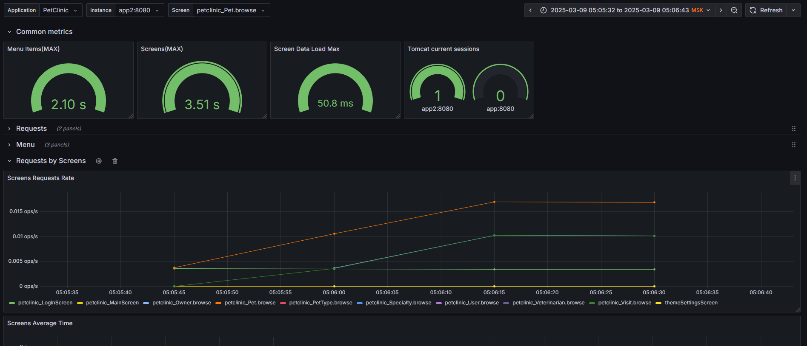
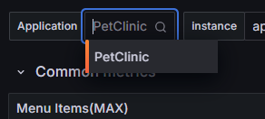

<h1>Jmix Grafana Dashboards</h1>
<h2>Standard Jmix Dashboards</h2>

This repository contains two dashboards for the Micrometer metrics that are exporting for the Prometheus datasource.
This dashboards should be used for the Grafana monitoring system.

There are two dashboards:
<ul>
    <li>The first one is for the <b>Jmix 1.6.0</b> version and later.</li>
    <li>The second one is for the <b>Jmix 2.2.0</b> version and later.</li>
</ul>


<h2>Base Prometheus Micrometer Settings for Jmix Application</h2>

Add the following libraries:
```
implementation 'org.springframework.boot:spring-boot-starter-actuator'
implementation 'io.micrometer:micrometer-registry-prometheus'
```
Add the following properties to your application:
```
management.endpoints.web.exposure.include=prometheus,health,info,metrics
management.endpoint.health.show-details=always
```
Add the Spring Security configuration

```
@Configuration
public class ActuatorSecurityConfiguration {
    @Bean
    @Order(JmixSecurityFilterChainOrder.FLOWUI - 10)
    public SecurityFilterChain securityFilterChain(HttpSecurity http) throws Exception {
        http.securityMatcher("/actuator/**")
                .authorizeHttpRequests((authorize) -> authorize.requestMatchers("/actuator/**").permitAll());
        return http.build();
    }
}
```

More details about Jmix applications monitoring you can find <a href="https://habr.com/ru/companies/haulmont/articles/825402/">here</a>. 

<h2>Application Name and Other Common Tags</h2>
In order to see the application name on the dashboards(especially if you have more than one application) the following application property should be added

```
management.metrics.tags.application = <YourApplicationName>
```
This tag will be added to all metrics that are exported with your application. Also, you can add your own common tags if you need.



More details about the <b>Spring Boot common tags</b> you can find <a href="https://docs.spring.io/spring-boot/reference/actuator/metrics.html#actuator.metrics.customizing.common-tags">here</a>.

<h2>Percentiles and Histograms</h2>

In addition to standard set of "Rate/Average Duration/Maximum Duration" metrics you can export percentiles metrics(such as "0.50", "0.99") with the specific Spring Boot properties.
For example the following property will add percentile metrics for all Jmix metrics.

```
management.metrics.distribution.percentiles.jmix = 0.50,0.95,0.99,0.999
```
Note that in order to visualize such additional metrics you should create your own visualisation in your Grafana.

More details about the <b>Spring Boot per-meter properties</b> you can find <a href="https://docs.spring.io/spring-boot/reference/actuator/metrics.html#actuator.metrics.customizing.per-meter-properties">here</a>. 


